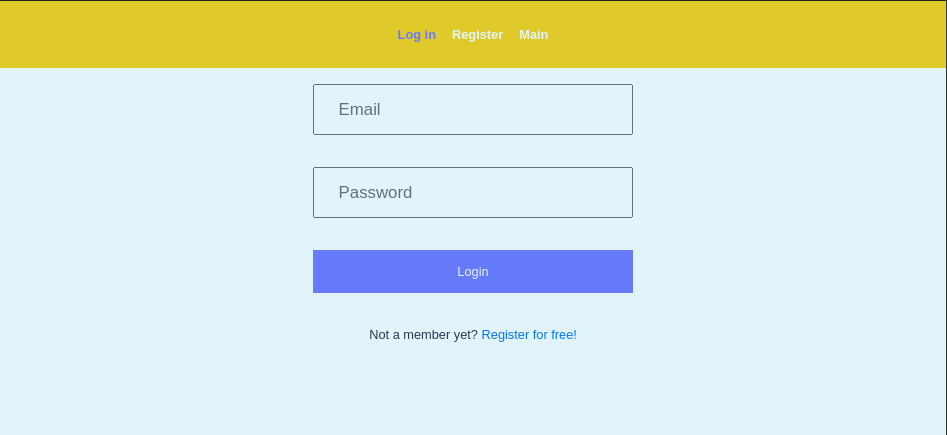
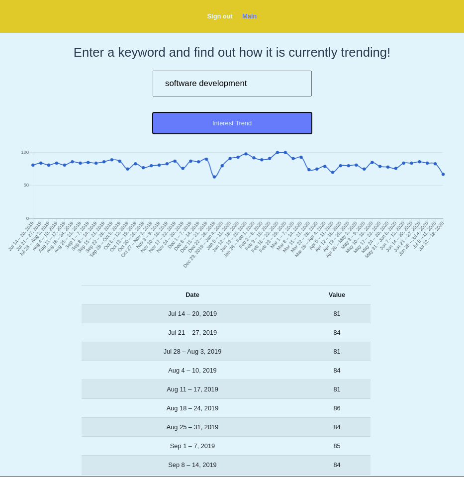

# Keyword Analyzer

[![Contributors][contributors-shield]][contributors-url]
[![Forks][forks-shield]][forks-url]
[![Stargazers][stars-shield]][stars-url]
[![Issues][issues-shield]][issues-url]

> Keyword Analyzer is an app that allows users to use the power of Google algorithms in a friendly and visual way. Users can create an account to access the keyword analyzing feature. The account information gets stored in Google's Firebase and gets accessed through an asynchronous call. The app features a friendly interface where signed in users can visualize the trend and novelty of the keywords they intend to use in their articles, blogs, or any publication before they even start! This app gives the users a head start, so that they know whether what they intend to write about is currently being searched or is already decaying in interest.





> For this project, I integrated the knowledge acquired while self-teaching Vue with the backend experience that I have. The Google Trends API that I used required a node server to make the calls, so I created one and deployed it to be able to retrieve the information, and then I created the asynchronous functions to retrieve it from the server. I used chart.js and bootstrap-vue to display the information in a user-friendly way. The user's information storage is handled by Google's Firebase on the backend.

## Live Version

[Live Version](https://keyword-analyzer.herokuapp.com/)

## Vide Presentation

[Video Presentation](https://www.loom.com/share/8fb1e70455cd4b19b7b95dc3f3712536)

## Vue Learning Schedule

| DAYS  |                                         OBJECTIVE                                         |                                                                                                                                                                                                                                                                                                                                                                                                                                                                                               DESCRIPTION                                                                                                                                                                                                                                                                                                                                                                                                                                                                                                |                                                                                                                   OUTCOME                                                                                                                    | STATUS  |
| :---- | :---------------------------------------------------------------------------------------: | :------------------------------------------------------------------------------------------------------------------------------------------------------------------------------------------------------------------------------------------------------------------------------------------------------------------------------------------------------------------------------------------------------------------------------------------------------------------------------------------------------------------------------------------------------------------------------------------------------------------------------------------------------------------------------------------------------------------------------------------------------------------------------------------------------------------------------------------------------------------------------------------------------------------------------------------------------------------------------------------------------: | :------------------------------------------------------------------------------------------------------------------------------------------------------------------------------------------------------------------------------------------: | :-----: |
| Day 1 |                                     Learn Vue basics                                      |                                                                                                                                                                                                                                                                                                                                                                                                                    I read several articles on how to learn Vue. I created a Cheatsheet on Google Docs to have all the most important information and basics of the language on hand.                                                                                                                                                                                                                                                                                                                                                                                                                     | I understood and learned the basics of Vue, how it differentiates from React and other frameworks and how they are similar so that I could use the knowledge that I already had in my advantage to learn the new language more efficiently.. | &#9745; |
| Day 2 |                              Tutorials and Hands-on Projects                              |                                                                                                                                                                                                                                                                                                                                                                                  I started building a simple calendar app using Vuetify following a tutorial by Traversy Media. I documented in the Google Docs cheatsheet all the new elements that I encountered as well as the common errors I made along the way..                                                                                                                                                                                                                                                                                                                                                                                   |                                By the end of the day, I had most of the project completed, I had created most of the functionality and had a solid cheat sheet that I could reference on the next projects..                                 | &#9745; |
| Day 3 |                             Tutorials and Hands-on Projects 2                             |                                                                                                                                                                                                                                                                                                                                                    On this day, I finished the calendar app, and I started a new tutorial by FreeCodeCamp. I coded most of the second tutorial by myself, and then I saw the tutorial to make sure I had followed best practices. I corrected what needed to be corrected and documented further on the Cheat Sheet.                                                                                                                                                                                                                                                                                                                                                     |                                                                  By the end of the day, I had completed the first app by myself using the newly acquired knowledge of Vue..                                                                  | &#9745; |
| Day 4 | Tutorials and Hands-on Projects part 3, and conceptualization of the project to showcase. | On this day, I finished the second part of the FreeCodeCamp tutorial, the pet adoption web-app. This project features database handling and Store operations. I added some more information to the cheat sheet and started thinking about an idea that I could use to build a project by myself. To get to the final idea, I explored Writtio's website, I requested an account to take the product for a ride, but it is not available for the public just yet, so I had to base it on the information available on the images and video in the website. I started working on the project. I found the API that I wanted to use. I created the skeleton of the project, and I tried to use the API to get the information. I read a lot on how to get it to work since I wanted to integrate everything in the same Vue app, but I realized that I would be mixing the front end and backend, so I decided to create another application to take care of the API request and serve it to the front end. |                                              By the end of the day, I had my third working Vue project, and I had started working on the project that I wanted to build, tailored for Writtio.                                               | &#9745; |
| Day 5 |                       Final touches, deployment and documentation.                        |                                                                                                                                                                                                                                                                  On this day, I was able to finish the project. I was able to present the information using a chart and a table for the users to be able to see it in a friendly way. I used Writtio's colors to get used to the combinations and the CSS of the element on the page. I integrated animations for the pages transitions and corrected the last bugs. I deployed to Heroku both the server and the web-app, made the appropriate testing, and created the documentation.                                                                                                                                                                                                                                                                  |                              By the end of the day, I had tailored a project to show. I had several future improvements and features that I wanted to work on that I think will add great value to the product.                              | &#9745; |

## Built With

### Developing tools

- Vue
- Vuex
- Axios
- Bootstrap
- Chart.js
- Chartkick
- google-trends-api
- Firebase

### Deployment

- Express
- Heroku
- Cors

## Getting Started

To get started with the app, please follow these steps:

- Navigate to the folder where you would like to save the app.

- Open your terminal by right-clicking, and opening the command line of your choice.

- Clone the repo by typing:

```
$ git clone git@github.com:lmaldonadoch/keyword-analyzer.git
```

- Access the newly created folder by typing:

```
$ cd keyword-analyzer
```

- Install the necessary dependencies:

```
npm install
```

- Bundle the resources and run the code locally:

```
$ npm run serve
```

- Open [http://localhost:8080/](http://localhost:8080/) on your browser.

### Prerequisites

- Node. If you do not have Node installed in your local machine, please refer to the [Official Documentation](https://nodejs.org/en/download/)
- Vue-CLI. If you do not have Vue-CLI installed in your local machine, please refer to [Official Documentation](https://cli.vuejs.org/)
- Basic command line knowledge.

## Author

👤 **Luis Angel Maldonado**

- Github: [@lmaldonadoch](https://github.com/lmaldonadoch)
- Twitter: [@LuisAngelMCh](https://twitter.com/LuisAngelMCh)
- LinkedIn: [lmaldonadoch](https://www.linkedin.com/in/lmaldonadoch)

## Future Upgrades

- Add multiple dataset plot functionality.
- Add other statistical information.
- Provide suggestions on better keywords to use based on the retrieved information.

## 🤝 Contributing

Feel free to check the [issues page](https://github.com/lmaldonadoch/keyword-analyzer/issues).

## Show your support

Give a ⭐️ if you like this project!

<!-- MARKDOWN LINKS & IMAGES -->

[contributors-shield]: https://img.shields.io/github/contributors/lmaldonadoch/keyword-analyzer.svg?style=flat-square
[contributors-url]: https://github.com/lmaldonadoch/keyword-analyzer/graphs/contributors
[forks-shield]: https://img.shields.io/github/forks/lmaldonadoch/keyword-analyzer.svg?style=flat-square
[forks-url]: https://github.com/lmaldonadoch/keyword-analyzer/network/members
[stars-shield]: https://img.shields.io/github/stars/lmaldonadoch/keyword-analyzer.svg?style=flat-square
[stars-url]: https://github.com/lmaldonadoch/keyword-analyzer/stargazers
[issues-shield]: https://img.shields.io/github/issues/lmaldonadoch/keyword-analyzer.svg?style=flat-square
[issues-url]: https://github.com/lmaldonadoch/keyword-analyzer/issues
